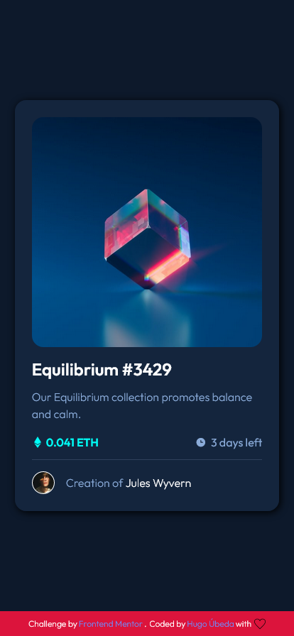
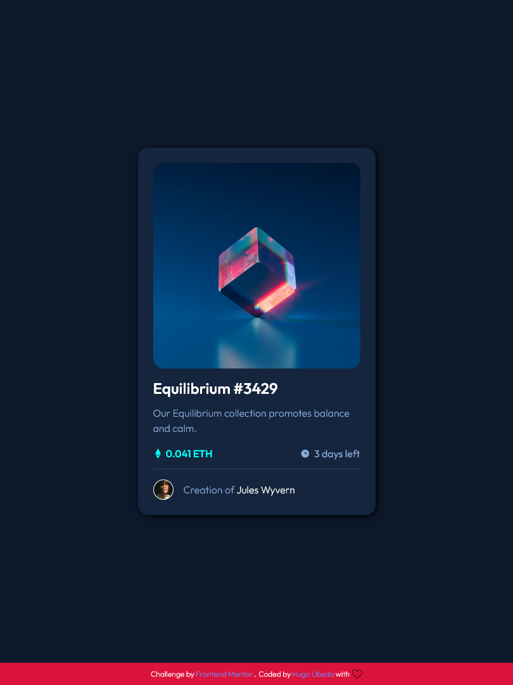
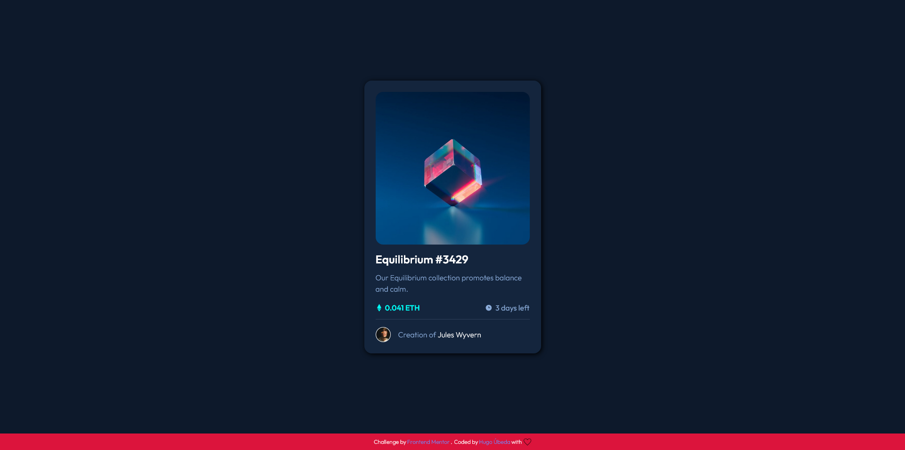

# Frontend Mentor - NFT preview card component solution

This is a solution to the [NFT preview card component challenge on Frontend Mentor](https://www.frontendmentor.io/challenges/nft-preview-card-component-SbdUL_w0U). Frontend Mentor challenges help you improve your coding skills by building realistic projects. 

## Table of contents

- [Overview](#overview)
  - [The challenge](#the-challenge)
  - [Screenshot](#screenshot)
  - [Links](#links)
- [My process](#my-process)
  - [Built with](#built-with)
  - [What I learned](#what-i-learned)
- [Author](#author)

## Overview

### The challenge

Users should be able to:

- View the optimal layout depending on their device's screen size
- See hover/active states for interactive elements

### Screenshot
## Mobile

## Tablet

## Desktop

### Links

- Solution URL: [https://www.frontendmentor.io/solutions/nft-preview-card-8Mow_aNsx](https://www.frontendmentor.io/solutions/nft-preview-card-8Mow_aNsx)
- Live Site URL: [https://hugoubeda.github.io/nft-preview-card/](https://hugoubeda.github.io/nft-preview-card/)

## My process

### Built with

- Semantic HTML5 markup
- CSS custom properties
- Flexbox
- Mobile-first workflow

### What I learned

I learned how to properly use opacity and HSLA/RGBA colors (transparency).

## Author

- Website - [Hugo Úbeda](https://github.com/hugoubeda)
- Frontend Mentor - [@hugoubeda](https://www.frontendmentor.io/profile/hugoubeda)